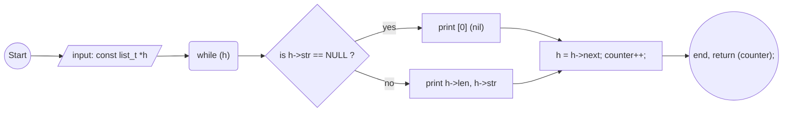

<h1>C - Singly linked lists</h1>

<h2> Learning Objectives</h2>

- When and why using linked lists vs arrays
- How to build and use linked lists

<h2>Please use this data structure for this project:</h2>
<pre><code>
/**
 * struct list_s - singly linked list
 * @str: string - (malloc'ed string)
 * @len: length of the string
 * @next: points to the next node
 *
 * Description: singly linked list node structure
 */
typedef struct list_s
{
    char *str;
    unsigned int len;
    struct list_s *next;
} list_t;
</code></pre>

<h2> Task 0.Print list</h2>

<h3>->Write a function that prints all the elements of a list_t list.</h3>

- Prototype: size_t print_list(const list_t *h);
- Return: the number of nodes
- Format: see example
- If str is NULL, print [0] (nil)
- You are allowed to use printf

<h3> -> My code</h3>

<A HREF="http:https://github.com/fernan2lopezkto/holbertonschool-low_level_programming/blob/master/singly_linked_lists/0-print_list.c">Click here for go to code</A>

<h3> -> My function flowchart</h3>

